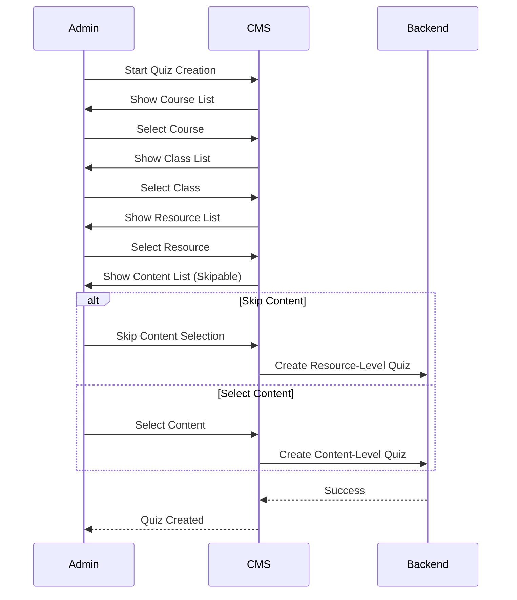

# MCQ System Documentation 

![[1st.png]]


## 1. Entity Relationship Diagram

```mermaid
erDiagram
    COURSE ||--o{ CLASS : contains
    CLASS ||--o{ RESOURCE : has
    RESOURCE ||--o{ CONTENT : contains
    RESOURCE ||--o{ QUIZ : has
    CONTENT ||--o{ QUIZ : optional

    COURSE {
        uuid id
        string title
    }
    CLASS {
        uuid id
        string title
    }
    RESOURCE {
        uuid id
        string title
    }
    CONTENT {
        uuid id
        string title
        enum type
    }
    QUIZ {
        uuid id
        string title
        uuid resourceId
        uuid contentId
    }
```

## 2. Quiz Creation Workflow



## 3. Key Features

### 3.1 Dual Attachment Points
![[dual.png]]


### 3.2 CMS Navigation Flow
![[cms-navigation.png]]

## 4. API Endpoints 

### Quiz Creation Endpoint
**POST /quizzes**
```json
{
  "title": "Basic HTML Quiz",
  "courseId": "course_123",
  "classId": "class_456",
  "resourceId": "resource_789",
  "contentId": "content_abc", // Optional
  "questions": [
    {
      "question": "What is HTML?",
      "options": [
        {"text": "Hyper Text Markup Language", "correct": true},
        {"text": "High-Level Machine Language"}
      ]
    }
  ]
}
```

**Validation Rules:**
1. `resourceId` is mandatory
2. `contentId` must belong to `resourceId` if provided
3. Either resourceId or contentId must be present (XOR relationship)

## 5. CMS Implementation Details

### 5.1 Quiz Type Handling
```javascript
const determineQuizType = (selections) => {
  if (selections.contentId) {
    return {
      type: 'CONTENT_LEVEL',
      parent: selections.contentId
    }
  }
  return {
    type: 'RESOURCE_LEVEL',
    parent: selections.resourceId
  }
}
```

### 5.2 Content Selection Component
```jsx
<ContentSelector
  resourceId={selectedResource.id}
  onSelect={handleContentSelect}
  onSkip={() => {
    setQuizType('RESOURCE_LEVEL');
    proceedToQuestionEditor();
  }}
  skipLabel="Create Resource-Level Quiz"
/>
```

## 6. LMS Display Logic

### 6.1 Resource View
```jsx
const ResourceView = ({ resource }) => (
  <div>
    <h1>{resource.title}</h1>
    
    {/* Resource-Level Quizzes */}
    {resource.quizzes.map(quiz => (
      <QuizCard key={quiz.id} quiz={quiz} />
    ))}
    
    {/* Contents with Quizzes */}
    {resource.contents.map(content => (
      <ContentItem key={content.id}>
        {content.title}
        {content.quiz && <QuizBadge quiz={content.quiz} />}
      </ContentItem>
    ))}
  </div>
)
```

### 6.2 Content View
```jsx
const ContentView = ({ content }) => (
  <div>
    <h2>{content.title}</h2>
    {content.quiz && <QuizLauncher quiz={content.quiz} />}
    <ContentRenderer content={content} />
  </div>
)
```

## 7. Database Schema

**Quizzes Table**
```sql
CREATE TABLE quizzes (
    id UUID PRIMARY KEY,
    title VARCHAR(255) NOT NULL,
    resource_id UUID NOT NULL REFERENCES resources(id),
    content_id UUID REFERENCES contents(id),
    CHECK (
        (content_id IS NOT NULL AND resource_id IS NOT NULL) OR
        (content_id IS NULL AND resource_id IS NOT NULL)
    ),
    FOREIGN KEY (content_id) REFERENCES contents(id)
);
```

**Indexes**
```sql
CREATE INDEX idx_quizzes_resource ON quizzes(resource_id);
CREATE INDEX idx_quizzes_content ON quizzes(content_id);
```

# API Endpoint Specification

## Admin Endpoints (CMS)

| Method | Endpoint | Description | Parameters | Example Request |
|--------|----------|-------------|------------|------------------|
| **Courses** |
| GET | `/courses` | List all courses | `?page=1&limit=10` | `GET /courses?limit=5` |
| POST | `/courses` | Create new course | - | `{ "title": "Web Development" }` |
| **Classes** |
| GET | `/courses/{courseId}/classes` | Get classes in course | - | `GET /courses/course_123/classes` |
| POST | `/courses/{courseId}/classes` | Create class in course | - | `{ "title": "HTML Basics" }` |
| **Resources** |
| GET | `/classes/{classId}/resources` | Get resources in class | - | `GET /classes/class_456/resources` |
| POST | `/classes/{classId}/resources` | Create resource | - | `{ "title": "Chapter 1" }` |
| **Contents** |
| GET | `/resources/{resourceId}/contents` | Get contents in resource | - | `GET /resources/res_789/contents` |
| POST | `/resources/{resourceId}/contents` | Create content | `type: text/video/quiz` | `{ "title": "Lesson 1", "type": "text" }` |
| **Quizzes** |
| POST | `/quizzes` | Create quiz | - | See below |
| PUT | `/quizzes/{quizId}` | Update quiz | - | `{ "title": "Updated Quiz" }` |
| DELETE | `/quizzes/{quizId}` | Delete quiz | - | `DELETE /quizzes/quiz_123` |
| GET | `/quizzes` | List all quizzes | `?courseId=...&classId=...` | `GET /quizzes?resourceId=res_789` |
| **Questions** |
| POST | `/quizzes/{quizId}/questions` | Add question | - | `{ "question": "What is HTML?", "options": [...] }` |
| PUT | `/questions/{questionId}` | Update question | - | `{ "question": "Updated question" }` |

**Quiz Creation Example:**
```json
POST /quizzes
{
  "title": "HTML Fundamentals Quiz",
  "courseId": "course_123",
  "classId": "class_456",
  "resourceId": "resource_789",
  "contentId": "content_abc", // Optional
  "questions": [
    {
      "question": "What does HTML stand for?",
      "options": [
        {"text": "Hyper Text Markup Language", "correct": true},
        {"text": "Home Tool Markup Language"}
      ]
    }
  ]
}
## 8. Permission Model

| Action | Admin | Student |
|--------|-------|---------|
| Create Resource Quiz | ✅ | ❌ |
| Create Content Quiz | ✅ | ❌ |
| Edit Any Quiz | ✅ | ❌ |
| Delete Quiz | ✅ | ❌ |
| Attempt Quiz | ❌ | ✅ |
| View Quiz Results | ✅ | ✅ |

## 9. Testing Scenarios

### 9.1 Resource-Level Quiz
```gherkin
Scenario: Create resource-level quiz
  Given I'm logged in as admin
  When I navigate to "Class > Resource"
  And I click "Create New Quiz"
  And I skip content selection
  Then I should see quiz in resource view
```

### 9.2 Content-Level Quiz
```gherkin
Scenario: Create content-level quiz
  Given I'm on resource details page
  When I select "Lesson 1: Introduction" content
  And I create quiz with 3 questions
  Then quiz should appear under selected content
```

## 10. Error Handling

**Conflict Resolution**
![[error.png]]


## 11. Maintenance Guide

**Key Monitoring Metrics**
1. Quiz creation success rate (resource vs content)
2. Average questions per quiz
3. Quiz attempt completion rate
4. API response time for /quizzes endpoint

**Audit Log Format**
```json
{
  "timestamp": "2023-08-20T14:30:00Z",
  "adminId": "admin_789",
  "action": "quiz_create",
  "details": {
    "quizId": "quiz_123",
    "type": "RESOURCE_LEVEL",
    "parentId": "resource_456",
    "questionsAdded": 5
  }
}
```

This refined documentation provides complete implementation guidance for:
1. Flexible quiz placement (Resource/Content level)
2. Optional content selection workflow
3. Clear hierarchical navigation
4. Robust validation of relationships
5. Dual display modes in LMS

Developers should follow the sequence diagrams and validation rules carefully, paying special attention to the XOR relationship between resourceId and contentId in quiz creation. The system allows maximum flexibility while maintaining data integrity through database constraints and application-level validation.